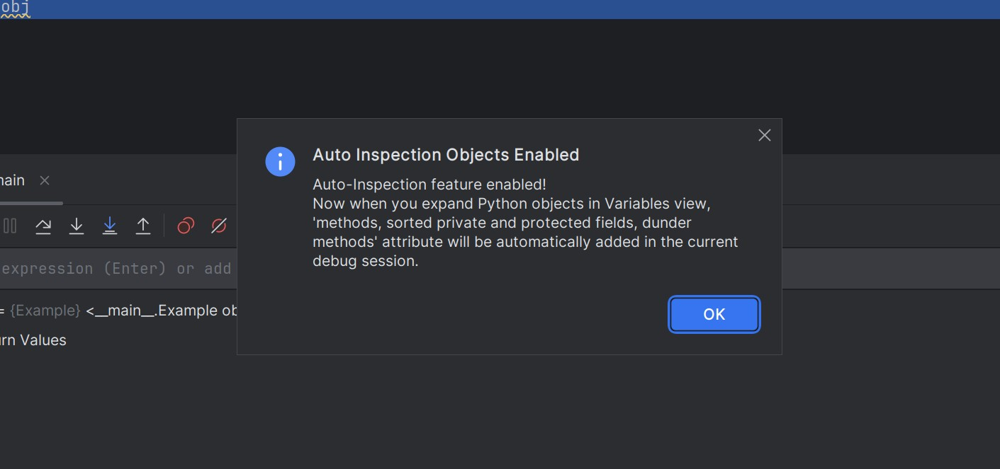
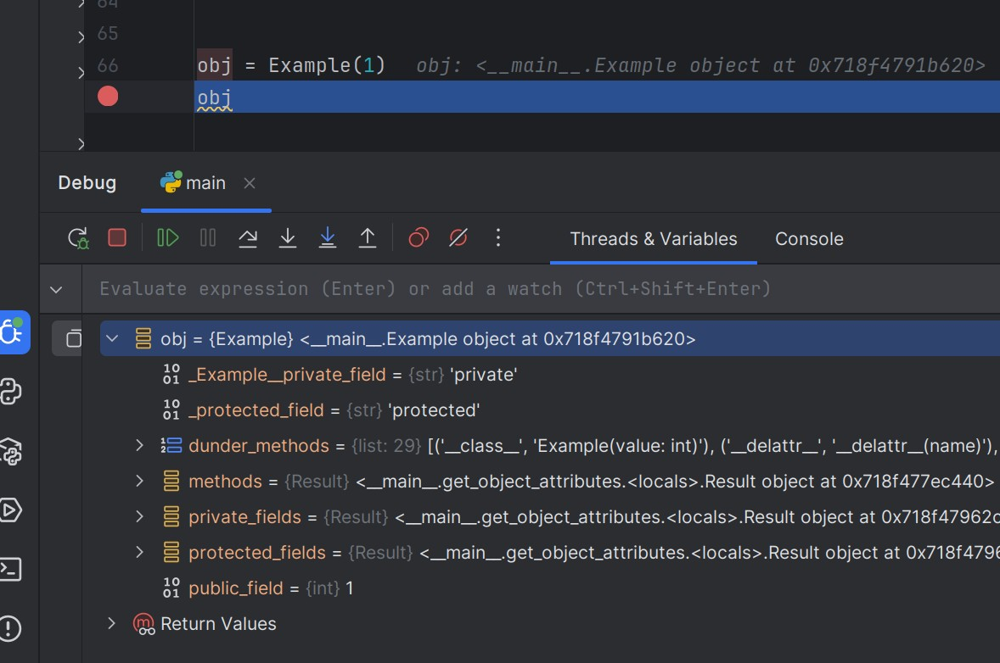
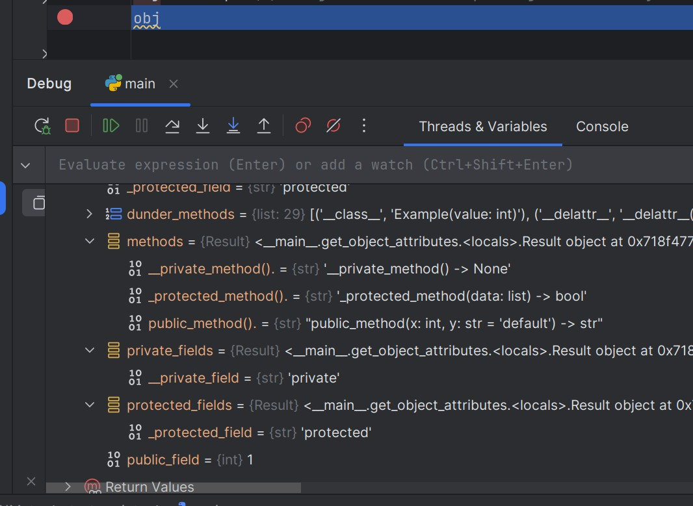

# Enhanced Debug View - PyCharm Plugin
[](docs/README_RU.md)

This plugin extends PyCharm debugger functionality by adding the ability to view available object methods during debugging.

## Features

- **Automatic mode**: Optionally show methods, grouped private and protected fields, and dunder methods for all objects automatically
- **Flexible configuration**: Filter private methods, magic (dunder) methods
- **Method signatures**: Display method signatures with parameters
- **Manual mode** for displaying additional data only for specific objects
- **One-session automatic mode**: Can be activated through context menu in debugging mode for one session

## Requirements

- PyCharm 2023.1 or higher

## Installation

 - Download file from release here https://github.com/trulander/EnhancedDebugView/releases
 - install the plugin directly from marketplace https://plugins.jetbrains.com/plugin/28205-enhanced-debug-view

## Usage

### Manual Mode (Default)

1. Start debugging a Python script
2. Stop at a breakpoint
3. In the Variables panel, right-click on any object
4. Select "Add extra data to the object" from the context menu
5. The selected object will display additional lists with user methods, private and protected fields, dunder methods and fields. Only what is configured in the plugin settings will appear.

<div>
<a href="docs/images/example6.jpg" target="_blank">
   
</a>
</div>

### Automatic Mode

1. Open `File` → `Settings` → `Tools` → `Enhanced Debug View`
2. Enable the "Automatically apply for all objects in the variable panel" option
3. Configure filters as desired:
    - Show object methods (starting with `_`)
    - Show magic methods and fields (`__init__`, `__str__`, etc.)
    - Show protected fields
    - Show private fields

4. Apply settings

### Automatic Mode for One Debugging Session Only
1. Run code in debugging mode
2. Wait for your code to stop at your first breakpoint
3. In the Threads & Variables tab, right-click in an empty area to open the context menu and select `Enable Auto adding extra data for the current session`
4. You will see a popup window with information about activating automatic mode for the current session
5. When navigating through the object tree, additional information will be added when expanding each object.

<div>
<a href="docs/images/example4.jpg" target="_blank">
  
</a>
</div>
<div>
<a href="docs/images/example5.jpg" target="_blank">
  
</a>
</div>

### Settings

The plugin provides the following configuration options:

- **Automatic method display**: Automatically show methods for all objects
- **Show private fields**: Methods starting with __ underscores, by default they are displayed as __Classname__privatemethod, but will be displayed as desired __privatemethod
- **Show protected fields**: Methods starting with _ underscore
- **Show user methods**: Show methods including method signature available to the object, the standard debugger doesn't display what methods an object has at all
- **Show all available dunder methods and fields of the object**: Displays all standard fields and methods starting with __ and ending with __, such as __init__, __dict__ etc.

<a href="docs/images/settings.jpg" target="_blank">
  
</a>

## Usage Example

```python
class Example:
    def __init__(self, value: int):
        self.public_field = value
        self._protected_field = "protected"
        self.__private_field = "private"

    def public_method(self, x: int, y: str = "default") -> str:
        return f"{x}: {y}"

    def _protected_method(self, data: list) -> bool:
        return len(data) > 0

    def __private_method(self) -> None:
        pass
        
obj = Example(1)
obj # Set breakpoint here

# In the Threads & Variables tab, when expanding object tabs, new fields with new information will be automatically added
```

<div>
<a href="docs/images/example1.jpg" target="_blank">
  
</a>
</div>

When using the plugin, you will see methods:

- `methods` (if method display is enabled)
- `--__private_method().`
- `--_protected_method().`
- `--public_method().`
- `dunder_methods` (if magic (dunder) methods are enabled)
- `--('__class__', 'Example(value: int)')`
- --...
- `private_fields` (if private methods are enabled)
- `--__private_field`
- `protected_fields` (if protected methods are enabled)
- `--_protected_field`
- And other inherited methods from `object`

<div>
<a href="docs/images/example2.jpg" target="_blank">
  
</a>
</div>
<div>
<a href="docs/images/example3.jpg" target="_blank">
  
</a>
</div>

## Troubleshooting

### Plugin Doesn't Work
- Make sure you're using PyCharm (not IntelliJ IDEA)
- Ensure you've configured the plugin in settings
- Restart PyCharm after installation

### Methods Don't Display
- Make sure you're in Python debugging mode
- Check plugin settings
- Ensure the object is a Python object (not a primitive; primitives won't display anything, e.g., list)

## Contributing

1. Fork the project
2. Create a feature branch (`git checkout -b feature/amazing-feature`)
3. Commit your changes (`git commit -m 'Add amazing feature'`)
4. Push to the branch (`git push origin feature/amazing-feature`)
5. Open a Pull Request

## Known Limitations

- Works only with Python objects
- Requires an active debugging session
- Automatic mode may affect performance with a large number of variables; if there are issues, you can use targeted manual mode for specific objects only
- If in manual mode after calling `Add extra data to the object` the data doesn't appear, it means PyCharm has cached the object computation results and you can step (F9) to the next line of code, and then the data will appear. Another approach is not to expand the object before adding new data to it, then PyCharm will load all fields at once
- Some built-in types may display a limited set of methods

## LICENSE

This plugin is licensed under GPLv3.

You are allowed to fork, modify, and redistribute it,
but any derivative work must also be licensed under GPLv3.
You must include a link to the original repository:
https://github.com/trulander/EnhancedDebugView

See the LICENSE file for details.
