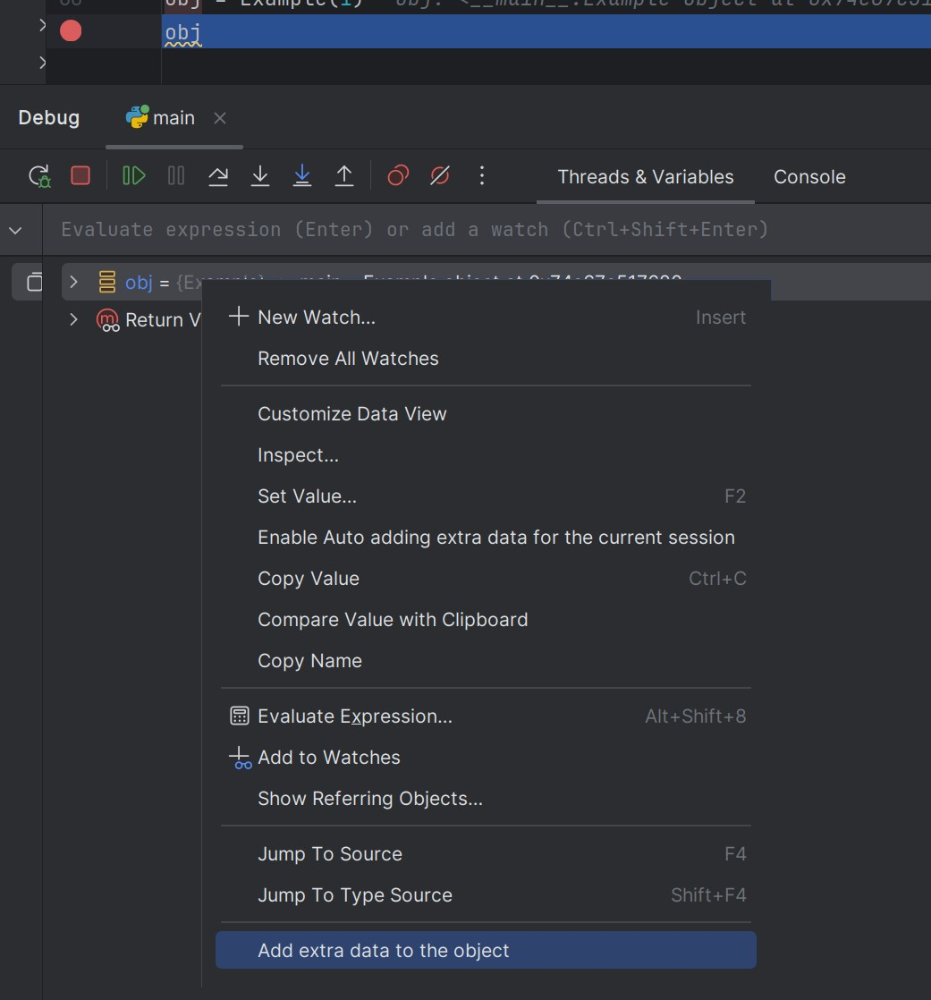
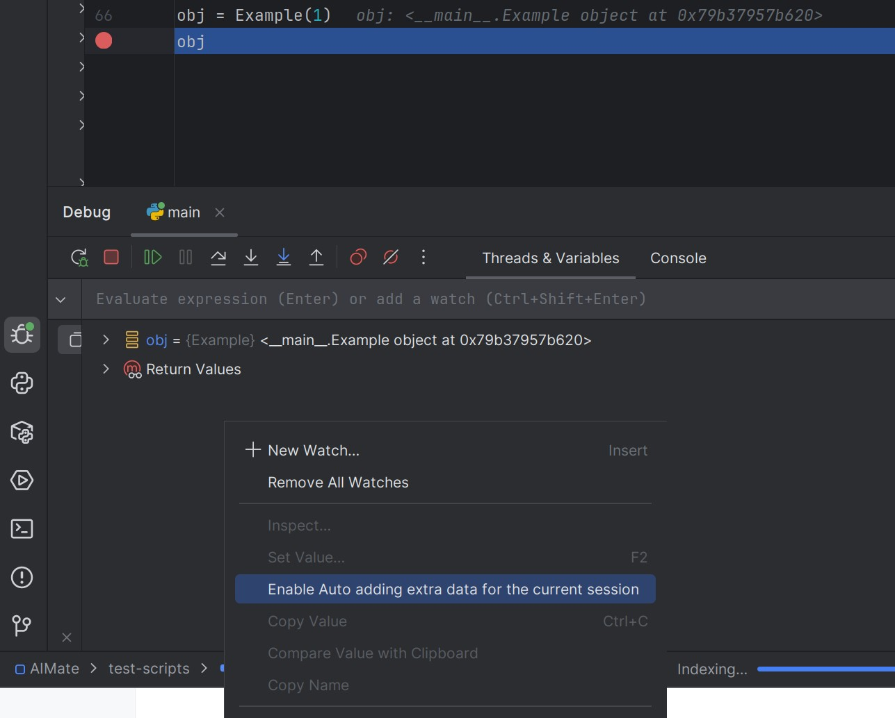
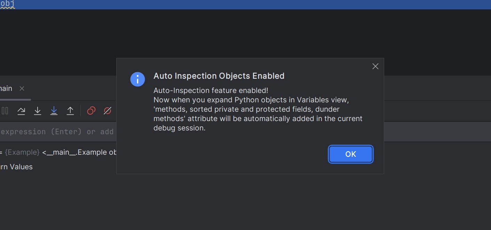
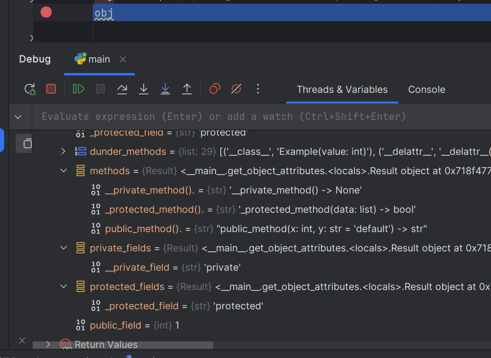
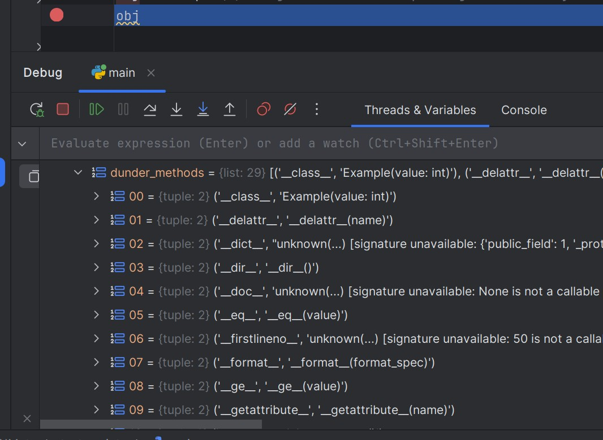

# Enhanced Debug View - Плагин для PyCharm
[](../README.md)

Этот плагин расширяет функциональность отладчика PyCharm, добавляя возможность просмотра доступных методов объектов во время отладки.

## Особенности

- **Автоматический режим**: Опционально показывать методы, сгруппированные приватные и защищенные поля и dunder методы для всех объектов автоматически
- **Гибкая настройка**: Фильтрация приватных методов, магических(dunder) методов 
- **Подписи методов**: Отображение сигнатур методов с параметрами
- **Ручной режим** отображения дополнительных данных только для конкретного обьекта
- **Автоматический режим на 1 сессию** Можно активировать через контекстное меню в режиме debugging на 1 сессию автоматический режим


## Требования

- PyCharm 2023.1 или выше

## Установка

 - Скачать плагин на страницу релизов и установить вручную https://github.com/trulander/EnhancedDebugView/releases
 - Утановить напрямую в IDE или со страницы маркетплейса https://plugins.jetbrains.com/plugin/28205-enhanced-debug-view

## Использование

### Ручной режим (по умолчанию)

1. Запустите отладку Python-скрипта
2. Остановитесь на breakpoint
3. В панели Variables щелкните правой кнопкой мыши на любом объекте
4. Выберите "Add extra data to the object" из контекстного меню
5. У выбранного обьекта появитятся дополнительные списки с пользовательскими методами, приватными и защищенными полями, dunder методы и поля. Появятся только то что настроено в настройках плагина.
<div>
<a href="../docs/images/example6.jpg" target="_blank">
   
</a>
</div>

### Автоматический режим

1. Откройте `File` → `Settings` → `Tools` → `Enhanced Debug View`
2. Включите опцию "Automatically apply for all objects in the variable panel"
3. Настройте фильтры по желанию:
   - Показывать методы обьекта (начинающиеся с `_`)
   - Показывать магические методы и поля (`__init__`, `__str__` и т.д.)
   - Показывать protected поля
   - Показывать private поля

4. Примените настройки

### Автоматический режим только на 1 debugging сессию
1. Запустите код в дежиме debugging
2. Дождитесь когда ваш код остановится на вашем первом breakpoint
3. Во вкладке Threads & Variables кликните правой кнопкой мышы в пустом месте чтобы вызвать контекстное меню и выберите пункт `Enable Auto adding extra data for the current session`
4. Вы увидите всплывающее окно с информацией по активации автоматического режима на текущую сессию
5. При навигации по дереву обьектов, при раскрытии каждого обьекта, будет добавляться дополнительная информация. 

<div>
<a href="../docs/images/example4.jpg" target="_blank">
  
</a>
</div>
<div>
<a href="../docs/images/example5.jpg" target="_blank">
  
</a>
</div>

### Настройки

Плагин предоставляет следующие опции настройки:

- **Автоматическое отображение методов**: Автоматически показывать методы для всех объектов
- **Показывать приватные поля**: Методы начинающиеся с __ подчеркивания, по умолчанию они отображаются как __Classname__privanemethod, а будут отображаться как и хотелось бы __privanemethod
- **Показывать защищенные поля**: Методы начинающиеся с _ подчеркивания
- **Показывать пользовательские методы**: Показывать методы включая сигнатуру метода доступные обьекту, стандартный debugger вообще не отображает какие методы есть у обьекта.
- **Показывать все доступные dunder методы и поля обекта**: Отображает все стандартные поля и методы начинающиеся с __ и заканчивающиеся __, такие как __init__, __dict__ etc..
  <a href="docs/images/settings.jpg" target="_blank">
  
  </a>


## Пример использования

```python
class Example:
    def __init__(self, value: int):
        self.public_field = value
        self._protected_field = "protected"
        self.__private_field = "private"

    def public_method(self, x: int, y: str = "default") -> str:
        return f"{x}: {y}"

    def _protected_method(self, data: list) -> bool:
        return len(data) > 0

    def __private_method(self) -> None:
        pass
        
obj = Example(1)
obj # Установите breakpoint здесь

# во вкладке Threads & Variables при раскрытии вкладок с обьектами у них автоматически будут добавляться новые поля с новой информацией
```
<div>
<a href="../docs/images/example1.jpg" target="_blank">
  
</a>
</div>

При использовании плагина вы увидите методы:

- `methods` (если включено отображение методов)
- `--__private_method().`
- `--_protected_method().`
- `--public_method().`
- `dunder_methods` (если включены магические(dunder) методы)
- `--('__class__', 'Example(value: int)')`
- --...
- `private_fields` (если включены приватные методы)
- `--__private_field`
- `protected_fields` (если включены защищенные методы)
- `--_protected_field`
- И другие унаследованные методы от `object`
<div>
<a href="../docs/images/example2.jpg" target="_blank">
  
</a>
</div>
<div>
<a href="../docs/images/example3.jpg" target="_blank">
  
</a>
</div>


### Плагин не работает
- Убедитесь, что вы используете PyCharm (не IntelliJ IDEA)
- Убедитесь что вы настроили плагин в настройках
- Перезапустите PyCharm после установки

### Методы не отображаются
- Убедитесь, что вы находитесь в режиме отладки Python
- Проверьте настройки плагина
- Убедитесь, что объект является Python-объектом (не примитивом, у примитивов ничего не будет отображаться, например у list)

## Вклад в проект

1. Сделайте fork проекта
2. Создайте feature branch (`git checkout -b feature/amazing-feature`)
3. Закоммитьте изменения (`git commit -m 'Add amazing feature'`)
4. Запушьте в branch (`git push origin feature/amazing-feature`)
5. Откройте Pull Request

## Известные ограничения

- Работает только с Python-объектами
- Требует активной сессии отладки
- Автоматический режим может влиять на производительность при большом количестве переменных, если будут проблемы, можно использовать точечный ручной режим только для конкретного обьекты
- Если в ручном режиме после вызова `Add extra data to the object` данные не появились, то это значит что pycharm закешировал результаты вычисления обьекта и можно сделать шаг(F9) на следующую строку кода, и тогда данные появятся. Другой подход не раскрывать оьект до добавления в него новых данных, тогда pycharm подгрузит все поля сразу. 
- Некоторые встроенные типы могут отображать ограниченный набор методов

## LICENSE

This plugin is licensed under GPLv3.

You are allowed to fork, modify, and redistribute it,
but any derivative work must also be licensed under GPLv3.
You must include a link to the original repository:
https://github.com/trulander/EnhancedDebugView

см. файл LICENSE для подробностей.
